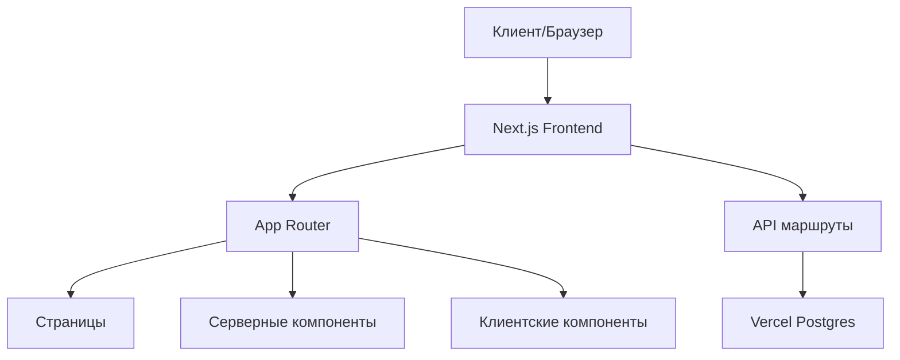

<div align="center">
  
  <h1>Великая Отечественная Война - Помним и гордимся</h1>
  
  <p>Интерактивный портал, посвященный истории Великой Отечественной Войны</p>

  [](https://vercel.com)
  [](https://nextjs.org/)
  [](https://reactjs.org/)
  [](https://www.typescriptlang.org/)
  [](https://tailwindcss.com/)
  [](LICENSE)
</div>

## 📋 Содержание

- [О проекте](#-о-проекте)
- [Демонстрация](#-демонстрация)
- [Особенности](#-особенности)
- [Технологии](#-технологии)
- [Начало работы](#-начало-работы)
  - [Предварительные требования](#предварительные-требования)
  - [Установка](#установка)
  - [Запуск](#запуск)
- [Архитектура](#-архитектура)
- [Структура проекта](#-структура-проекта)
- [API](#-api)
- [Деплой](#-деплой)
- [Дорожная карта](#-дорожная-карта)
- [Лицензия](#-лицензия)
- [Контакты](#-контакты)

## 🔍 О проекте

Интерактивный веб-портал, посвященный истории Великой Отечественной Войны, ее героям, ключевым событиям и сохранению памяти о подвиге советского народа. Проект создан с использованием современных веб-технологий и ориентирован на предоставление информативного и увлекательного опыта для пользователей всех возрастов.


## 🌟 Особенности

- **Современный дизайн** 🏆 
  - Стильный и современный интерфейс с темной темой
  - Адаптивная верстка для всех устройств
  
- **Интерактивная хронология** 📅 
  - Лента времени с ключевыми датами и событиями ВОВ
  - Интерактивные маркеры с подробным описанием
  
- **Галерея героев** 🎖️ 
  - Поиск по региону и наградам
  - Возможность добавления информации о своих родственниках
  
- **Исторический раздел** 📚 
  - События, фотографии и статьи о ВОВ
  - Архивные материалы и свидетельства
  
- **Интерактивные тесты** 🧠 
  - Проверка знаний по истории ВОВ
  - Разные уровни сложности
  
- **Образовательные материалы** 🎬 
  - Подборки фильмов, книг и ресурсов
  - Рекомендации для разных возрастных групп
  
- **Счетчик до 9 мая 2025 года** ⏰ 
  - Отсчет до 80-летия Великой Победы

## 🚀 Технологии

<table>
  <tr>
    <td align="center" width="96">
        
        <br>Next.js 15
    </td>
    <td align="center" width="96">
        
        <br>React
    </td>
    <td align="center" width="96">
        
        <br>TypeScript
    </td>
    <td align="center" width="96">
        
        <br>Tailwind CSS
    </td>
    <td align="center" width="96">
        
        <br>Vercel
    </td>
  </tr>
  <tr>
    <td align="center" width="96">
        
        <br>Radix UI
    </td>
    <td align="center" width="96">
        
        <br>PostgreSQL
    </td>
    <td align="center" width="96">
        
        <br>Framer Motion
    </td>
    <td align="center" width="96">
        
        <br>Git
    </td>
    <td align="center" width="96">
        
        <br>React Icons
    </td>
  </tr>
</table>

## 🚦 Начало работы

### Предварительные требования

- [Node.js](https://nodejs.org/) (версия 18.x или выше)
- [npm](https://www.npmjs.com/) или [yarn](https://yarnpkg.com/) или [pnpm](https://pnpm.io/)
- [Git](https://git-scm.com/)

### Установка

1. Клонируйте репозиторий

```bash
git clone https://github.com/moontify/hahaton-vov.git
cd hahaton-vov
```

2. Установите зависимости

```bash
npm install
# или
yarn install
# или
pnpm install
```

3. Настройте переменные окружения

```bash
cp .env.example .env.local
```

Отредактируйте файл `.env.local`, добавив необходимые переменные окружения.

### Запуск

1. Запустите проект в режиме разработки

```bash
npm run dev
# или
yarn dev
# или
pnpm dev
```

2. Откройте [http://localhost:3000](http://localhost:3000) в браузере.

## 🏗️ Архитектура

### Основные принципы

- **Серверный рендеринг (SSR)** - улучшение SEO и скорости первой загрузки
- **Инкрементальная статическая регенерация (ISR)** - для оптимизации производительности
- **Context API** - для эффективного управления состоянием
- **Fetch API** - для асинхронных операций и взаимодействия с бэкендом
- **App Router** - роутинг на основе файловой системы Next.js
- **RESTful API** - взаимодействие с сервером через стандартизированный интерфейс
- **Компонентный подход** - разделение UI на переиспользуемые компоненты

### Схема архитектуры



## 📦 Структура проекта

```
src/
│
├── app/                   # Директории маршрутизации Next.js App Router
│   ├── page.tsx           # Главная страница
│   ├── history/           # Раздел "История"
│   ├── heroes/            # Раздел "Галерея героев" 
│   ├── interactive/       # Раздел "Интерактивные тесты"
│   └── education/         # Раздел "Образовательные материалы"
│
├── components/            # Компоненты React
│   ├── layout/            # Компоненты макета (Header, Footer)
│   ├── home/              # Компоненты для главной страницы
│   ├── history/           # Компоненты для раздела истории
│   ├── heroes/            # Компоненты для галереи героев
│   ├── interactive/       # Компоненты для раздела тестов
│   ├── education/         # Компоненты для образовательных материалов
│   └── ui/                # Многоразовые UI компоненты
│
├── contexts/              # Context API для управления состоянием
│
├── api/                   # Функции для работы с API
│
├── types/                 # TypeScript типы и интерфейсы
│
└── lib/                   # Утилиты и вспомогательные функции
```

## 🌐 API

Проект предоставляет RESTful API для работы с данными о героях ВОВ и историческими событиями.

### Эндпоинты героев

| Метод | URL | Описание |
|-------|-----|----------|
| GET | `/api/heroes` | Получение списка героев с возможностью фильтрации |
| GET | `/api/heroes/:id` | Получение информации о герое по ID |
| POST | `/api/heroes` | Добавление нового героя |
| PUT | `/api/heroes/:id` | Обновление информации о герое |
| DELETE | `/api/heroes/:id` | Удаление героя |

#### Пример запроса и ответа

```typescript
// Получение списка героев с фильтрацией
const heroes = await getHeroes({ region: 'Москва', award: 'Орден Ленина' });

// Получение информации о герое по ID
const hero = await getHeroById(1);

// Добавление нового героя
const newHero = await addHero({
  name: 'Иванов И.И.',
  rank: 'Лейтенант',
  region: 'Москва',
  description: 'Описание',
  years: '1920-1945',
  photo: '/images/heroes/ivanov.jpg',
  awards: ['Орден Красной Звезды']
});
```

### Работа с базой данных

```
GET /api/init-db?key=YOUR_ADMIN_API_KEY
GET /api/init-db?key=YOUR_ADMIN_API_KEY&seed=true  // С тестовыми данными
```

## 🚢 Деплой

Проект оптимизирован для деплоя на платформе [Vercel](https://vercel.com).

### Настройка Vercel

1. **Создайте аккаунт Vercel** (если у вас его еще нет)
   - Зарегистрируйтесь на [vercel.com](https://vercel.com)

2. **Установите Vercel CLI**
   ```bash
   npm install -g vercel
   ```

3. **Войдите в аккаунт Vercel через CLI**
   ```bash
   vercel login
   ```

4. **Импортируйте проект в Vercel Dashboard**
   - Нажмите "Import Project" на dashboard.vercel.com
   - Выберите опцию "Import Git Repository" и укажите ссылку на ваш репозиторий
   - Или используйте команду `vercel` в корневой директории проекта

### Настройка базы данных

1. **Настройте базу данных Vercel Postgres**
   - В панели управления проектом на Vercel выберите вкладку "Storage"
   - Нажмите "Create" и выберите "Postgres Database"
   - Следуйте инструкциям по созданию базы данных

2. **Добавьте переменные окружения**
   - В настройках проекта на Vercel перейдите во вкладку "Environment Variables"
   - Добавьте переменную `ADMIN_API_KEY` с секретным значением для защиты API инициализации БД

3. **Инициализируйте базу данных**
   - После деплоя проекта, перейдите по URL:
   ```
   https://your-project-url.vercel.app/api/init-db?key=YOUR_ADMIN_API_KEY
   ```
   - Для добавления тестовых данных используйте:
   ```
   https://your-project-url.vercel.app/api/init-db?key=YOUR_ADMIN_API_KEY&seed=true
   ```

## 📊 Дорожная карта

- [x] Главная страница с лентой времени и счетчиком
- [x] Исторический раздел с событиями и фотогалереей
- [x] Галерея героев с формой поиска
- [x] Интерактивные тесты
- [x] Раздел образовательных материалов
- [x] Добавление фотографий героев и иллюстраций
- [x] Интеграция с API для хранения данных
- [ ] Модерация контента, добавляемого пользователями
- [ ] Расширенное покрытие unit-тестами
- [ ] Настройка полноценного CI/CD пайплайна
- [ ] Многоязычная поддержка
- [ ] Интеграция с социальными сетями
- [ ] Мобильное приложение

## 📄 Лицензия

Проект распространяется под лицензией MIT. Подробности в файле [LICENSE](LICENSE).

## 📮 Контакты

Если у вас есть вопросы или предложения по улучшению проекта, свяжитесь с нами:

[](https://t.me/nam0er1)
[](https://github.com/moontify/hahaton-vov/issues)

---

<div align="center">
  <sub>Проект разработан с ❤️ для сохранения памяти о Великой Отечественной Войне и её героях</sub>
</div>
